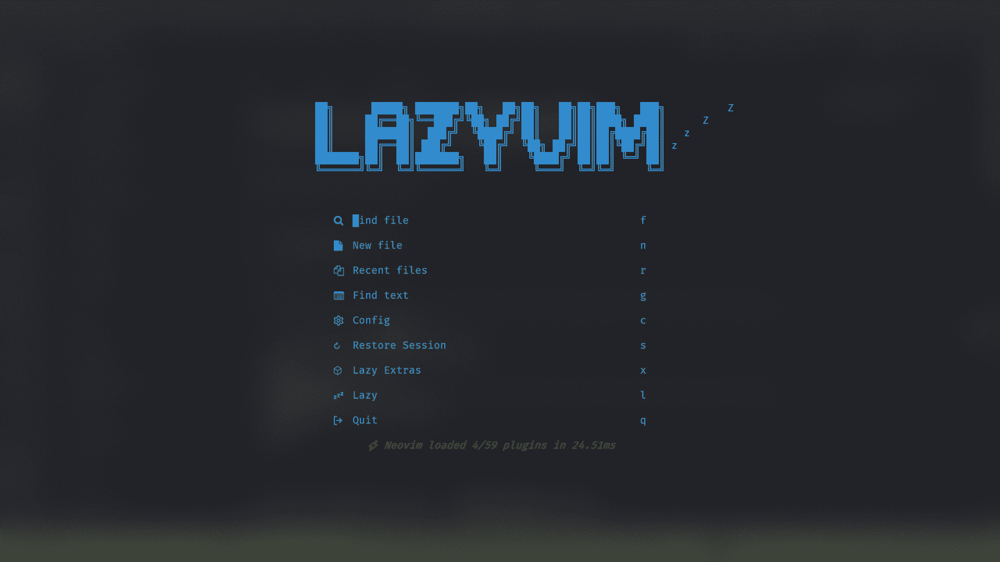
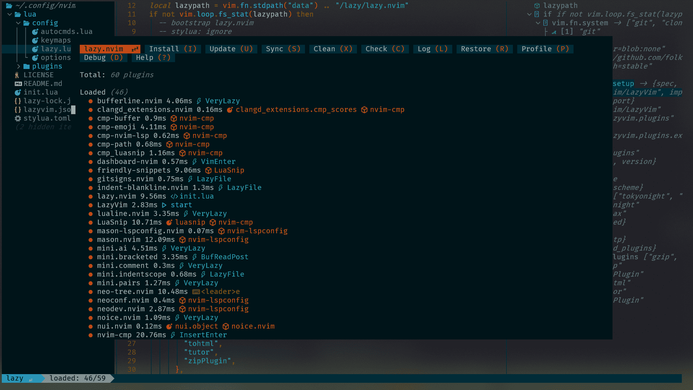
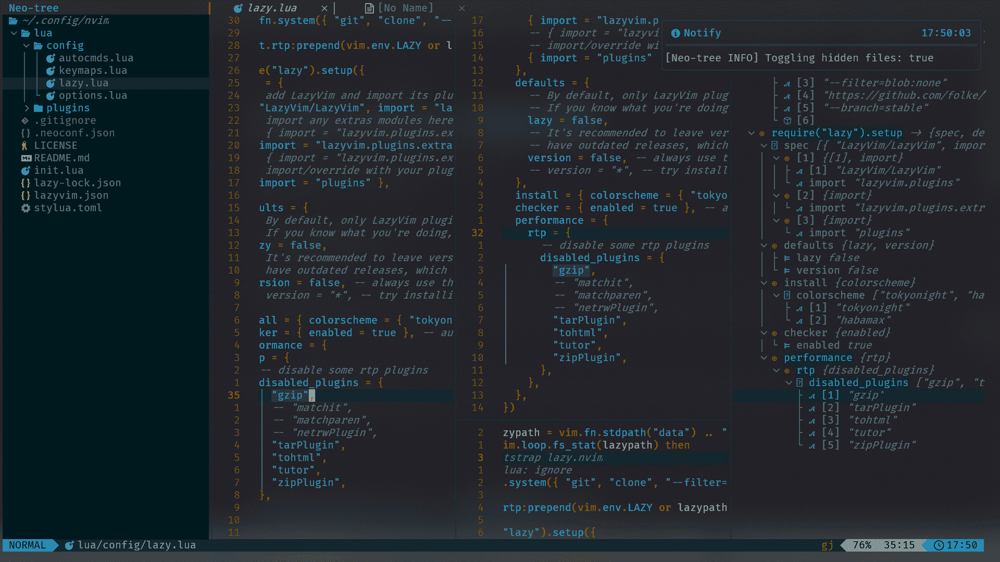

# 💤 nvchad

A starter template for nvchad.







## Requirements


- `Windows`

  ```shell
  scoop install fd ripgrep fzf nodejs make cmake luarocks
  ```

  

- `MacOS`

  ```shell
  brew install fd ripgrep fzf nodejs make cmake luarocks
  ```
